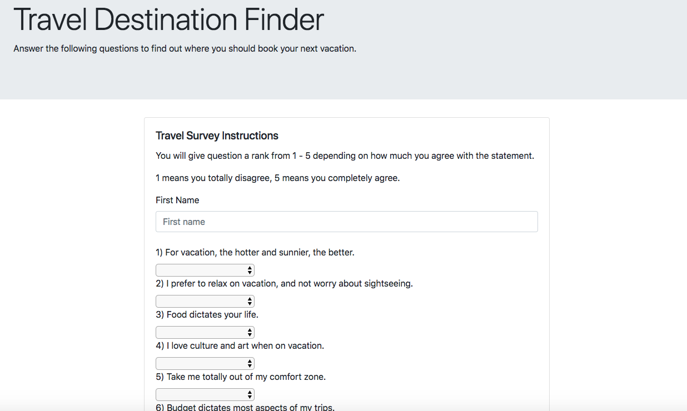
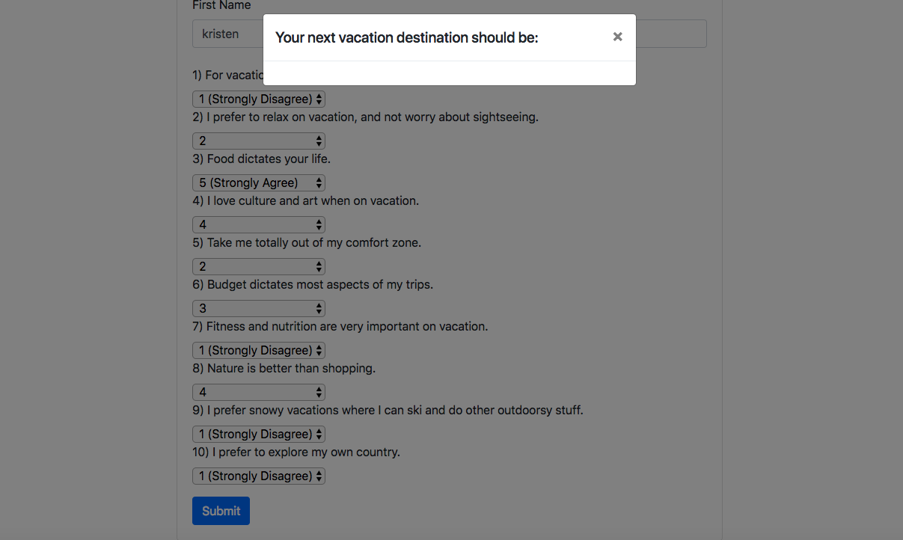

<h1>Travel-finder</h1>

This is an app to find the best vacation spot using node and MySQL. User will take a 10-question survey and find out which travel destination would suit him/her.

<h4>Home Page</h4>

<h4>Survey Page</h4>

<h4>Home Page</h4>

<h3>Technologies Used:</h3>
<ul>
    <li>Node.js</li>
    <li>API</li>
    <li>MySQL</li>
    <li>Express</li>
</ul> 

